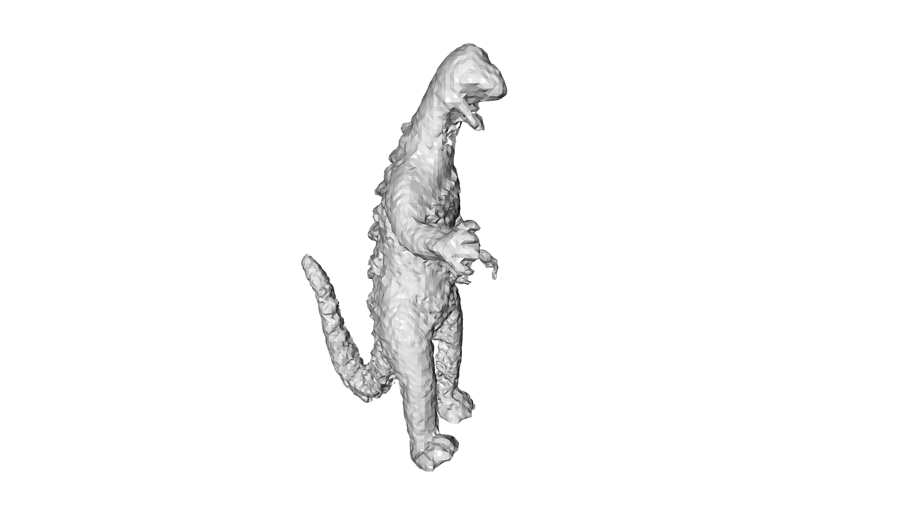

# Shape from Silhouette

Forked from [zinsmatt](https://github.com/zinsmatt/SpaceCarving).
Added marching cubes with [PyMCubes](https://github.com/pmneila/PyMCubes) and visualisation with [Open3D](http://www.open3d.org/docs/0.8.0/index.html).

